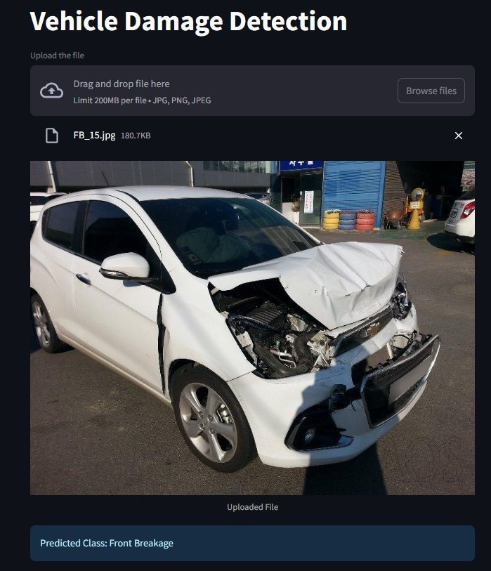

# 🚗 Car Damage Detection Using Deep Learning

## 📌 Problem Statement

Car damage detection is a crucial task in the automotive industry for insurance claims, resale value estimation, and fleet maintenance. In this project, the goal is to develop a deep learning model for **Vroom Cars** that can **classify front and rear car images into six predefined damage categories**. The task involves training a robust classification model capable of generalizing to unseen car images.

## 🚘 Vehicle Damange Detection App
This app allows you to drag and drop an image of a car, and it will identify the type of damage present. 

---

## 🧠 Technologies & Tools Used

* **Python**
* **PyTorch** – Deep Learning Framework
* **NumPy, Pandas** – Data Manipulation
* **Matplotlib, Seaborn** – Visualization
* **EfficientNet, ResNet** – Pretrained CNN Models for Transfer Learning
* **Optuna** – Hyperparameter Optimization
* **Sklearn** – Evaluation Metrics (Confusion Matrix, Classification Report)

---

## 🧺 Project Workflow

### 1. 📂 Data Loading & Transformation

* Loaded high-resolution images of cars from multiple angles (front and rear).
* Applied transformations: resizing, normalization for efficient deep learning model training.
* Used **data augmentation** (random cropping, flipping, rotation) to enrich the dataset.
* Total images: **2,300**, split into:

  * **Training set:** 1,725 images (75%)
  * **Validation set:** 575 images (25%)

### 2. 🏠 Baseline Model Training

* Built a custom Convolutional Neural Network (CNN).
* **Loss Function:** CrossEntropyLoss
* **Optimizer:** Adam
* Observed **overfitting**: training loss decreased while validation loss remained high.

### 3. 🛡️ Overfitting Mitigation

* Introduced techniques to address overfitting:

  * **Batch Normalization**
  * **Dropout Layers**
  * **L2 Regularization**
* Overfitting persisted due to **limited dataset size**.

### 4. 🧠 Transfer Learning

* Switched to pretrained models for better generalization:

  * **EfficientNet**:

    * Frozen convolutional layers.
    * Trained only the classifier head.
    * Reduced training time and computational cost.
  * **ResNet**:

    * Unfroze `layer4`.
    * Replaced final FC layer to fine-tune higher-level features.

### 5. 🔧 Hyperparameter Tuning

* Used **Optuna** for tuning hyperparameters:

  * Learning rate.
  * Dropout rate.
  * Optimizer settings.

### 6. 📈 Model Evaluation

* Evaluated final model using:
  
    -**Confusion Matrix**:Shows how well a classification model predicts classes by comparing actual vs. predicted labels.
  
    -**Accuracy**: Correctly predicted instances.
  
    -**Precision**: Proportion of positive predictions that are correct.
  
    -**Recall**: Proportion of actual positives that were predicted.
  
    -**F1 Score**: The harmonic mean of Precision and Recall.

---

## 📊 Results

The  model, **ResNet**  with optimized parameters , delivered the best results. Transfer learning and hyperparameter tuning significantly reduced overfitting, enabling the model to perform well on unseen data.

---

## 💼 Business Impact

* **Faster & Automated Damage Detection:** Eliminates the need for time-consuming manual inspections.
* **Accurate Car Pricing:** Assists used car marketplaces in setting fair and competitive prices based on damage levels.
* **Rapid Insurance Claim Processing:** Benefits Property & Casualty insurers and enhances customer satisfaction with faster claim settlements.
* **Operational Efficiency:** Streamlines inspection workflows for fleet managers and dealerships.

